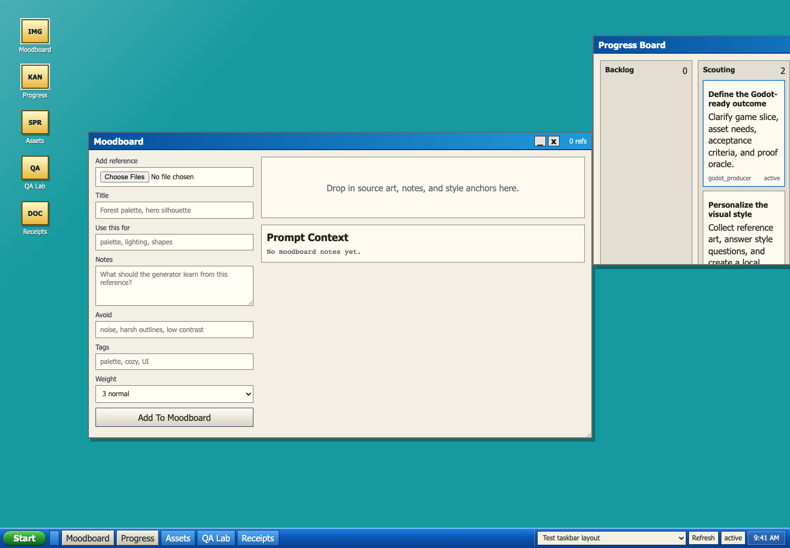
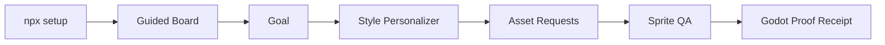
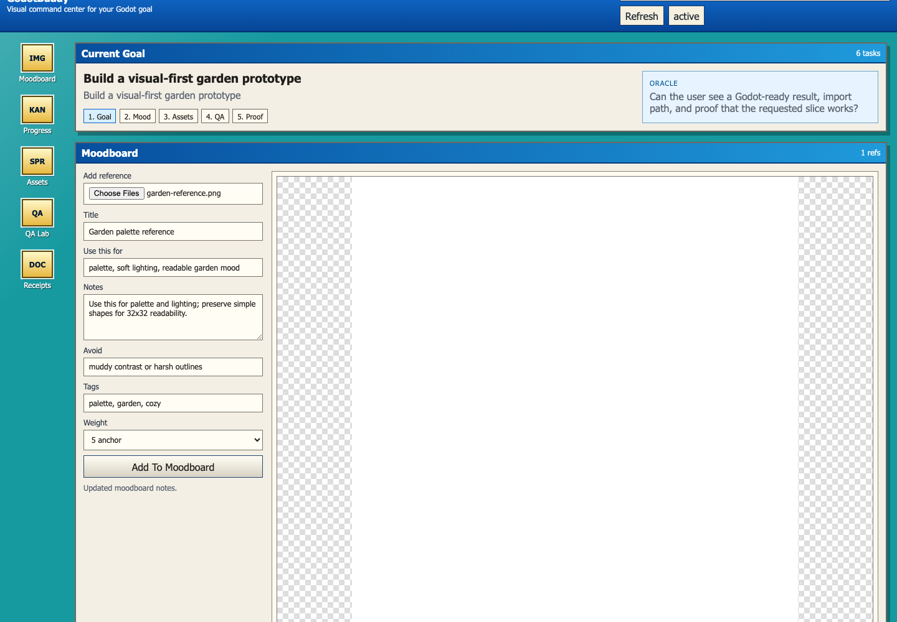

# GodotBuddy

[](https://www.npmjs.com/package/godotbuddy)
[](LICENSE)

GodotBuddy is a GoalBuddy-style local workflow companion for Godot game development.

## Install

GodotBuddy is published on npm as [`godotbuddy`](https://www.npmjs.com/package/godotbuddy).

Start a guided local setup with:

```bash
npx godotbuddy@latest setup
```

Then create the first guided board:

```bash
npx godotbuddy@latest quickstart
```

Power users can also install it globally:

```bash
npm install -g godotbuddy
godotbuddy setup
```

It combines:

- a CLI
- a local web board
- a repo-owned run workspace
- asset previews
- receipts/proof files
- Codex-style agent prompts
- a Godot editor addon dock
- bundled Godot and sprite-generation skill packs

The goal is to make Godot game development feel more hand-held: you can see what is being built, which assets exist, what still needs review, and what proof says the current slice is done.



## Quick Start For Most Users

```bash
npx godotbuddy@latest setup
```

That creates a local `.godotbuddy/` workspace, installs the generic GodotBuddy
skills, and writes an install receipt. From there, open the local board when
Codex or GodotBuddy asks you to continue the journey.

```bash
npx godotbuddy@latest quickstart
```

`quickstart` starts a guided board for the first playable slice. You can keep
the board open while Codex walks through the goal, style, assets, QA, and proof.



## Install Matrix

| User | Command | What happens |
| --- | --- | --- |
| First-time user | `npx godotbuddy@latest setup` | Installs the local GodotBuddy workspace and generic skills. |
| Guided first run | `npx godotbuddy@latest quickstart` | Opens the board and creates a first-playable journey. |
| Repeated use | `npm install -g godotbuddy` | Makes `godotbuddy` available without `npx`. |
| Existing Godot project | `godotbuddy install-addon` | Adds the small Godot editor dock. |
| Contributors | `npm test` | Runs the package tests locally. |

## Guided Journey

GodotBuddy is a goals tool for Godot projects with visual asset workflows.
The CLI is available for power users, but the intended operator flow is:

```text
Setup -> Goal -> Style -> Assets -> Sprite QA -> Godot Integration -> Proof
```

The local board includes:

- a simple goal and oracle summary
- a retro desktop-style command center
- a Moodboard for source art, notes, tags, weights, and prompt context
- a Progress Board for pipeline tasks
- an Asset Studio for sprite/output previews
- sprite QA actions
- receipts and proof logs
- a taskbar bug button that opens a GitHub issue with the right project

`godotbuddy setup` is the first-run path. It creates `.godotbuddy/config.json`,
personalizes the local project defaults, installs the bundled skills into
`${CODEX_HOME:-~/.codex}/skills/`, and writes a setup receipt to
`.godotbuddy/receipts/first-run-setup.md`.

`godotbuddy quickstart` adds the first guided run and opens the local board.

## Repo workspace created by GodotBuddy

```text
.godotbuddy/
  config.json
  hub.json
  runs/
    <run-slug>/
      goal.md
      state.json
      board/board.json
      asset-manifest.json
      requests/
      handoffs/
      notes/
      receipts/
      assets/
        source/
        generated/
        final/
        previews/
      godot/
      qa/
```

`state.json` is the source of truth for the local board. The web UI is just a live view over that file.

## CLI commands

```bash
godotbuddy init
godotbuddy quickstart
godotbuddy scaffold --project "Name" --install-addon
godotbuddy personalize --name "Soft Forest" --art-style storybook --reference /path/to/reference.png
godotbuddy prep --goal "..."
godotbuddy asset --name player --type character --animations idle,walk --style generic
godotbuddy attach --asset player --file /path/to/spritesheet.png --kind final
godotbuddy task --title "Wire player movement" --lane godot_integration
godotbuddy move --task <task-id> --lane done
godotbuddy qa
godotbuddy promote-style-pack --style soft-forest
godotbuddy receipt --title "Imported player sprites" --body "Verified in Godot." --file assets/final/player.png
godotbuddy board
godotbuddy doctor
godotbuddy install-addon
godotbuddy install-skills
```

## Included Godot editor addon

The addon is intentionally small. It adds a dock with buttons to open the local board and `.godotbuddy` workspace.

Install it into a project with:

```bash
godotbuddy install-addon --project /path/to/godot/project
```

Then enable it in Godot:

```text
Project Settings -> Plugins -> GodotBuddy -> Enable
```

## Included bundled skills

GodotBuddy includes the Godot skill suite under `bundled-skills/`.

Install them into Codex-style skill folders during first-run setup:

```bash
godotbuddy setup --project-name "My Game"
```

This copies installable `SKILL.md` folders into:

```text
${CODEX_HOME:-~/.codex}/skills/
```

You can also install only the skills:

```bash
godotbuddy install-skills
```

The installed skills remain modular sibling workers. GodotBuddy owns the local
control plane, board, assets, receipts, and Godot addon handoffs.

Personal project style packs can live beside the generic suite, but they are
not part of the default public install. Use
`--include-personal-style-packs true` only when you intentionally want those
local packs installed.

## Personalize A Style

The board can create a local style pack from reference images and a few simple
answers. The output stays project-owned:

```text
.godotbuddy/style-packs/<style-slug>/
  style-pack.json
  SKILL.md
  references/
```

Promote a style pack only when you intentionally want a shareable folder:

```bash
godotbuddy promote-style-pack --style <style-slug>
```

## Moodboard

The Moodboard is the visual source of truth for a project. Keep the browser
open, add reference images, click images to edit notes, and tell Codex what each
reference should influence.



```text
.godotbuddy/moodboard/
  moodboard.json
  references/
```

Each reference can track:

- title
- tags
- notes
- use-this-for guidance
- avoid guidance
- importance weight

Asset requests include the composed moodboard prompt context so generation can
use the project’s visual direction instead of isolated one-off prompts.

## Sprite QA

GodotBuddy records QA reports under the active run:

```text
.godotbuddy/runs/<run>/qa/sprite-qa-report.json
```

The first QA pass checks attached sprite files, expected animation manifests,
missing references, and import-readiness signals. Future QA workers can expand
this into deeper image inspection and agent-assisted repair loops.

## Clean package boundary

Generated project state is intentionally ignored by this package repo:

```text
.godotbuddy/
godotbuddy-demo/
*.tgz
node_modules/
```

The npm package uses an explicit `files` allowlist so test runs, local boards,
and per-game usage receipts do not ship by accident.

## Publishing checks

Before publishing, run:

```bash
npm test
npm run smoke:package
npm pack --dry-run
```

`prepublishOnly` runs the test suite and package smoke automatically. The
package homepage currently points to the GitHub README so the public install
has one stable source of truth. A dedicated domain such as `godotbuddy.dev`
can be added later when docs grow beyond the repository README.

GodotBuddy is MIT licensed so it can stay a permissive open source tool for
people building games.

## Why this is a plugin/app instead of only a skill

A skill is excellent for instructions and repeatable scripts. GodotBuddy adds persistent run state, a local board, asset visibility, receipts, agent handoffs, and a Godot editor dock. The skills still matter, but they become workers under the GodotBuddy control plane.
